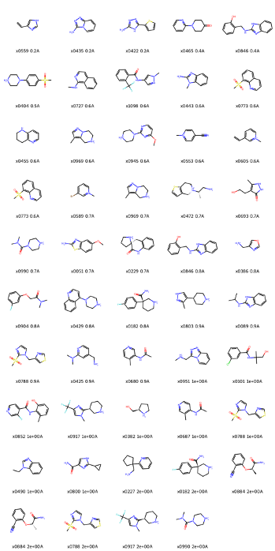

## Molecular Dynamics

Whereas the fragment hits are small (median 176 Da), so any absolute free of binding would be highly inaccurate [cf. https://www.nature.com/articles/s42004-022-00721-4]. However, the behaviour of a compound in a molecular dynamics trajectories can be beneficial. 2 ns molecular dynamics trajectories for each compounds were run. The median RMSD of the compound relative to the crystallographic state was lower than 1 Å for 33 fragment hits. Three/Five had a median RMSD less than 0.5 Å (i.e. were firmly in place during the simulation) and were Z362020366, Z119990326, and Z1587220559, the first two in the S1 pocket, while the third is the sole S1’ hit. A common theme is present for all the S1 hits, namely that interactions with Asp129 are not essential. Whereas the native ligand has an arginine at position 1, whose guanidine group froms a cation pi interaction with Tyr161 and a salt-bridge with Asp129, these fragment hits pi-pi stack with Tyr161, but form limited hydrogen bonding with the Asp129. This is evident when the median minimum distance to these residues calculated across all frames. These values across the dataset showed a trend wherein the RMSD of the compound fraction of frames within 4.0 Å of a given residue correlated best for His51 (.44) and Asp83 (.38) and Asp75 (.37), i.e. the S2 pocket, which was populated solely by Z425338146 and Z396117078, and Z2509342103, all three bound with a median RMSD ≤0.6 Å. However, it could be conjectured that this pocket is harder to accommodate but due to the more demanding requirements, the compounds bind more rigidly, than in S1. 
Gly151 is a residue in the catalytic site whose backbone oxygen acts as a hydrogen bond donor to the native substrate, making it catalytically essential. This residue also showed some correlation (0.22) between fragment RMSD and fraction of frames close to it. However, most S1 hits do form hydrogen bond interaction with it. Two notable exceptions are Z1165350851 and Z31113727, contain a 3-pyrazolone and a 4-pipperidinone ring respectively which can form an
 hydrogen-bond acceptor interaction with Gly151. These are uncommon groups, leading to the conjecture that it is worthwhile interaction, but hard to achieve.

| zcode         | RMSD median | RMSD std | RMSD max | GLY 151:B | SER 135:B | HIS 51:B | ASP 75:B | TYR 161:B | ASP 129:B | ASP 83:A |
|---------------|-------------|----------|----------|-----------|-----------|-----------|-----------|-----------|-----------|-----------|
| Z1198149728   | 0.16        | 0.05     | 0.3      | 3.45      | 3.97      | 5.66      | 8.63      | 4.84      | 6.49      | 9.73      |
| Z362020366    | 0.2         | 0.04     | 0.36     | 3.59      | 3.87      | 6.58      | 9.43      | 4.36      | 5.62      | 10.57     |
| Z119990326    | 0.21        | 0.06     | 0.46     | 3.58      | 3.72      | 6.83      | 9.42      | 4.37      | 6.33      | 10.23     |
| Z31113727     | 0.37        | 0.18     | 0.64     | 4.43      | 3.88      | 7.03      | 10.07     | 3.88      | 5.36      | 9.89      |
| Z1587220559   | 0.44        | 0.53     | 1.91     | 6.26      | 3.99      | 4.83      | 10.21     | 9.6       | 12.41     | 10.4      |
| Z425338146    | 0.55        | 0.18     | 0.8      | 4.73      | 4.08      | 3.53      | 4.19      | 6.76      | 10.11     | 3.81      |
| Z1216833237   | 0.56        | 0.18     | 0.9      | 3.54      | 3.79      | 6.09      | 8.97      | 4.11      | 5.5       | 9.89      |
| Z396117078    | 0.57        | 0.16     | 0.89     | 3.38      | 3.54      | 3.97      | 4.8       | 4.51      | 6.71      | 4.64      |
| Z56791928     | 0.57        | 0.22     | 0.83     | 3.46      | 3.64      | 5.47      | 8.53      | 4.92      | 6.4       | 9.28      |
| Z1269220427   | 0.58        | 0.23     | 0.77     | 16.74     | 16.25     | 11.05     | 9.56      | 23.21     | 27.28     | 14.37     |
| Z212053854    | 0.6         | 0.3      | 0.97     | 3.76      | 3.79      | 5.57      | 8.55      | 4.4       | 5.8       | 9.08      |
| Z2509342103   | 0.62        | 0.23     | 0.83     | 8.25      | 9.36      | 4.04      | 3.61      | 12.37     | 17.51     | 3.83      |
| Z228587394    | 0.62        | 0.18     | 1.15     | 3.6       | 3.63      | 5.79      | 8.99      | 3.58      | 5.2       | 9.54      |
| Z57493554     | 0.63        | 0.24     | 0.93     | 4.07      | 3.97      | 7.19      | 10.11     | 4.06      | 6.19      | 9.96      |
| Z1269221363   | 0.64        | 0.19     | 0.97     | 5.95      | 7.1       | 8.39      | 10.97     | 4.34      | 6.25      | 8.79      |
| Z1269220427   | 0.65        | 0.22     | 1.41     | 3.53      | 3.83      | 5.54      | 8.82      | 4.21      | 5.92      | 9.15      |
| Z1269184291   | 0.65        | 0.26     | 0.94     | 3.99      | 4.19      | 6.87      | 9.82      | 4.05      | 5.97      | 9.87      |
| Z2509342103   | 0.66        | 0.2      | 0.91     | 3.49      | 3.68      | 6.57      | 9.57      | 3.69      | 5.5       | 11.08     |
| Z270834034    | 0.67        | 0.16     | 1.22     | 3.49      | 3.85      | 4.87      | 7.64      | 4.34      | 6.19      | 4.08      |
| Z1165350851   | 0.71        | 0.29     | 1.52     | 3.78      | 3.98      | 5.8       | 8.51      | 4.3       | 6.06      | 9.09      |
| Z270760338    | 0.73        | 0.17     | 1.07     | 3.55      | 4.15      | 6.93      | 9.85      | 3.63      | 4.39      | 9.51      |
| Z1201620232   | 0.73        | 0.29     | 1.16     | 3.98      | 4.38      | 4.62      | 7.92      | 3.98      | 5.88      | 9.07      |
| Z238590196    | 0.73        | 0.14     | 1.04     | 3.61      | 3.84      | 6.76      | 9.65      | 3.88      | 4.09      | 9.23      |
| Z1587220559   | 0.76        | 0.31     | 1.55     | 10.9      | 10.71     | 14.52     | 17.92     | 6.99      | 3.59      | 16.52     |
| Z1962142017   | 0.79        | 0.24     | 1.66     | 3.82      | 4.23      | 7.06      | 9.62      | 4.32      | 6.27      | 10.42     |
| Z19755216     | 0.8         | 0.29     | 1.78     | 3.62      | 4.11      | 6.57      | 9.36      | 3.76      | 4.34      | 11.03     |
| Z57477251     | 0.82        | 0.12     | 1.5      | 3.48      | 4.23      | 4.24      | 7.05      | 4.21      | 5.98      | 6.45      |
| POB0087       | 0.85        | 0.1      | 1.16     | 10.1      | 13.95     | 13.38     | 8.34      | 14.47     | 19.01     | 11        |
| Z1416193393   | 0.86        | 0.19     | 1.12     | 3.56      | 3.69      | 6.33      | 9.47      | 3.63      | 4.45      | 9.61      |

Compounds with movement in MD

