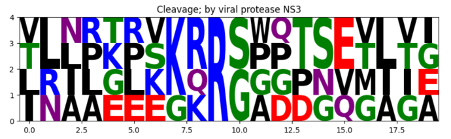
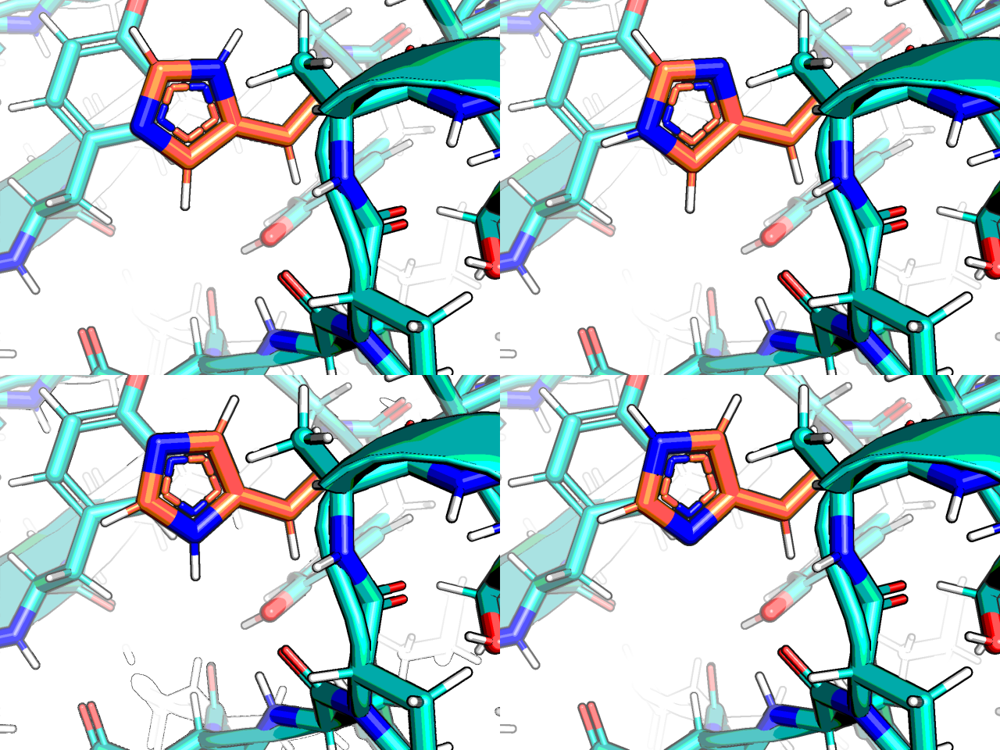

## Zika NS2B-NS3 protease

> This is a different target than the macro domain of coronavirus NSP3,
> for that see https://github.com/matteoferla/NSP3-macrodomain

I did two initial iteration of elaborations for this target, but did not release them to GitHub,
as these were no longer required.
This repo was made for the curated elaborations.

### Context
The catalytic triad is Asp75, His51 and Ser135

### Curated set
**Dataset**: [manual-designs.sdf](compounds/manual-designs.sdf)
**Notebook**: [manual-designs.ipynb](notebooks/manual-designs.ipynb)

The hits were manually inspected and mergers designed by eye
and searched for with SmallWorld (hosted by John Irwin at sw.docking.org) and with Arthor (arthor.docking.org).

| ID            | SMILES                                                                                             | dG_bind | comRMSD |
|---------------|----------------------------------------------------------------------------------------------------|---------|---------|
| PV-004740099668 | C1C[NH2+]CCC1N4C=C(NC(=O)C3=CC=CC(NC(=O)C2=CC=CN=C2)=C3)C=N4                                      | -11.66  | 0.82    |
| Z2451096380    | C1C[NH2+]CCC1N3C=C(NC(=O)C2=CC=CC(NC(=O)C)=C2)C=N3                                                 | -11.63  | 0.39    |
| Z2451096235    | C1C[NH2+]CCC1N3C=C(NC(=O)C2=CC=CC=C2)C=N3                                                          | -11.11  | 0.29    |
| Z2451096209    | C1C[NH2+]CCC1N3C=C(NC(=O)C2=CC=CC=C2C(F)(F)F)C=N3                                                  | -10.74  | 0.27    |
| Z3104214173    | C1C[NH2+]CCC1N3C=C(NC(=O)C2=CC=C(O)C(C)=C2)C=N3                                                    | -10.48  | 0.40    |
| Z4002297688    | C1C[NH2+]CCC1N4C=C(NC(=O)C3=CC=CC2=NC(C)=NN23)C=N4                                                 | -9.05   | 0.55    |
| Z3104214179    | C1C[NH2+]CCC1N3C=C(NC(=O)C2=CC=CC(=O)N2)C=N3                                                       | -8.35   | 0.30    |
| Z2451096211    | C1C[NH2+]CCC1N3C=C(NC(=O)C2=CC=CC(Cl)=C2)C=N3                                                      | -8.05   | 0.42    |
| Z396117078     | Cn1cc(NC(=O)c2ccccc2C(F)(F)F)cn1                                                                   | -7.45   | 0.15    |
| Z2451099201    | C1C[NH2+]CCC1N3C=C(NC(=O)C2=CC(=O)NC=C2)C=N3                                                       | -6.67   | 0.30    |
| Z425338146     | [H]c1c([H])c(S(=O)(=O)C([H])([H])[H])c([H])c([H])c1N1C([H])([H])C([H])([H])[N+]([H])([H])C([H])([H])C1([H])[H] | -6.63   | 0.36    |

## Side note: partial charge on x1098 (methylpyrazole)

x1098 is right above the catalytic histine, which is interesting.

## Side note: MD

See [MD.md](MD.md) for the MD details.

### x0559 & chemical isomorphism

This target features a fragment hit which I like to use to showcase chemical isomorphism (C/N/O ambiguity)
arising from X-ray crystallography:
this fragment hit could be placed 4 ways:

But in MD the incorrect ones slips into a different conformation (cf. [x0559.mpg](images/x0559/x0559.mpg))