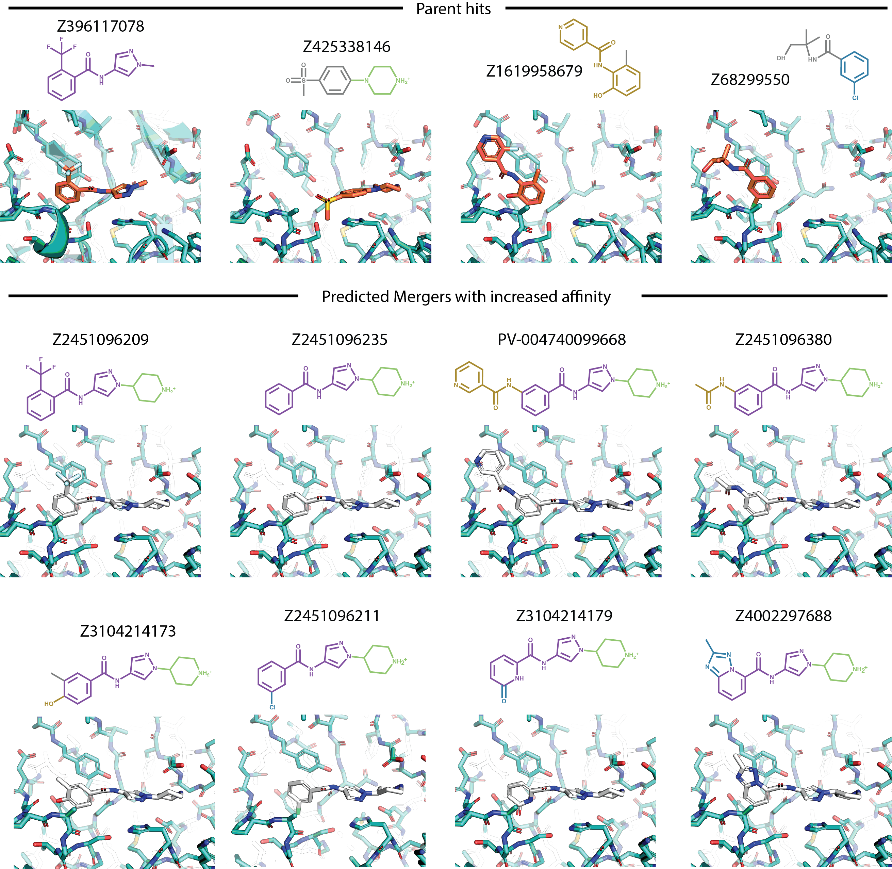
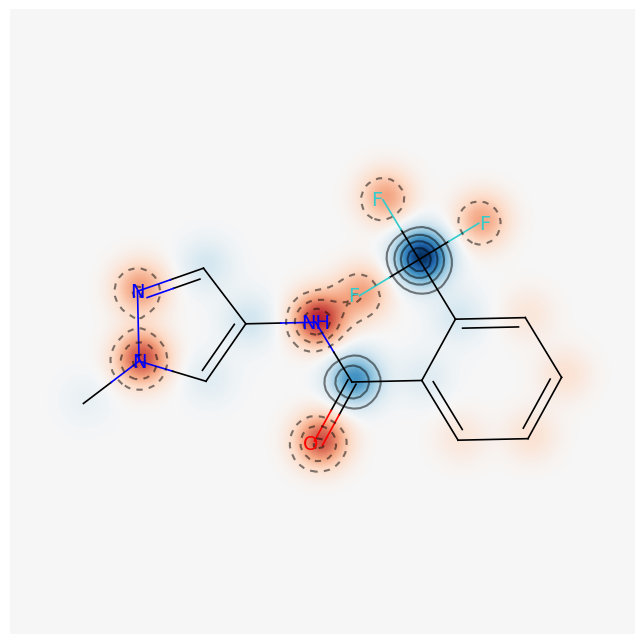
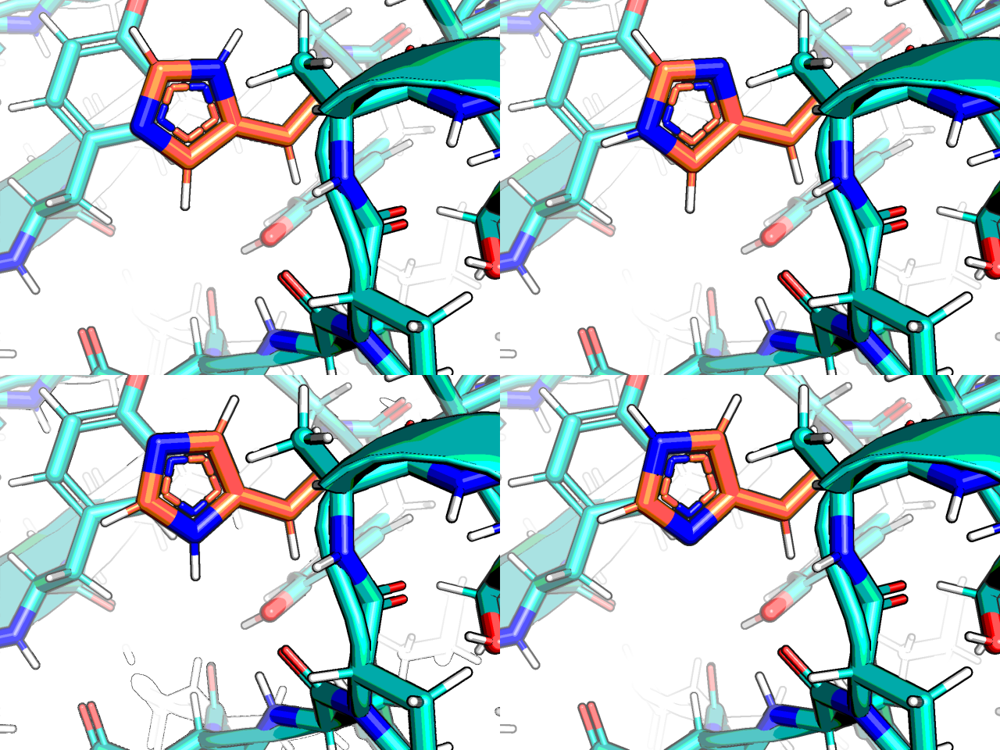

## Zika NS2B-NS3 protease

> This is a different target than the macro domain of coronavirus NSP3,
> for that see https://github.com/matteoferla/NSP3-macrodomain

I did two initial iteration of elaborations for this target, but did not release them to GitHub,
as these were no longer required.
This repo was made for the curated elaborations.

### Curated set

The hits were manually inspected and mergers designed by eye
and searched for with SmallWorld (hosted by John Irwin at sw.docking.org) and with Arthor (arthor.docking.org).

## Side note: charge on x1098 (methylpyrazole)

x1098 is right above the catalytic histine, which is interesting.

## Side note: x0559 & chemical isomorphism

This target features a fragment hit which I like to use to showcase chemical isomorphism (C/N/O ambiguity)
arising from X-ray crystallography:
this fragment hit could be placed 4 ways:

But in MD the incorrect ones slips into a different conformation (cf. [x0559.mpg](x0559/x0559.mpg))